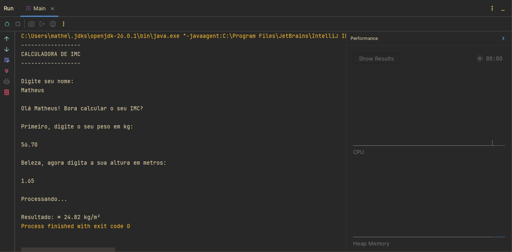

# Calculadora de IMC em Java

Projeto desenvolvido durante meus estudos de **Java** com o objetivo de praticar entrada de dados, utilização da classe `Math` e realização de cálculos utilizando a linguagem.

## Sobre este repositório

Este repositório faz parte da minha jornada de aprendizado em Java. Meu objetivo é documentar os principais exercícios e projetos desenvolvidos ao longo dos estudos, registrando minha evolução na linguagem e construindo um portfólio para oportunidades de estágio e desenvolvimento de software.

## Descrição

O programa solicita o nome do usuário, seu peso (em quilogramas) e sua altura (em metros). Em seguida, realiza o cálculo do Índice de Massa Corporal (IMC) utilizando operações matemáticas e exibe o resultado formatado com duas casas decimais.

> **Observação:** Atualmente, o projeto realiza apenas o cálculo do IMC, sem apresentar a classificação (abaixo do peso, peso normal, sobrepeso etc.).

## Tecnologias e conceitos utilizados

- IntelliJ IDEA
- Java
- Scanner
- Locale
- Classe `Math`
- Método `Math.pow()`
- Variáveis e tipos primitivos
- Operadores aritméticos
- Entrada e saída de dados
- Formatação de números com `System.out.printf()`

## Demonstração

<p align="center">
  
</p>

## Estrutura do projeto

```text
java-calculadora-imc/
│
├── images/
│   └── capturaIMC.jpg
│
├── Main.java
│
└── README.md
```

## Objetivo

Praticar conceitos fundamentais da linguagem Java, especialmente:

- leitura de dados utilizando a classe `Scanner`;
- utilização de variáveis do tipo `String` e `double`;
- realização de cálculos matemáticos;
- utilização da classe `Math`;
- formatação de saída no console.

## Aprendizados

Durante o desenvolvimento deste projeto, pratiquei:

- utilização da classe `Scanner`;
- configuração da localidade com `Locale`;
- manipulação de variáveis e tipos primitivos;
- utilização da classe `Math`;
- cálculos com números de ponto flutuante;
- formatação de saída utilizando `System.out.printf()`;
- organização básica de um programa em Java.

## Como executar

Clone este repositório:

```bash
git clone https://github.com/SEU-USUARIO/java-calculadora-imc.git
```

Acesse a pasta do projeto:

```bash
cd java-calculadora-imc
```

Compile o programa:

```bash
javac Main.java
```

Execute:

```bash
java Main
```

## Autor

**Matheus Ferreira Lopes**

Estudante de Desenvolvimento de Software Multiplataforma (FATEC Diadema)
